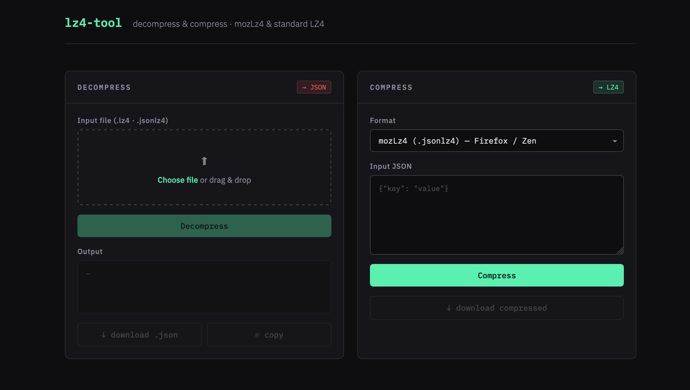

# compresso

A vibe coded single-file browser tool for decompressing and compressing LZ4 files. No server, no dependencies.

---

## Features

- **Decompress** `.lz4`, `.jsonlz4`, and `.baklz4` files in the browser
- **Compress** JSON text back to either format
- Drag and drop file input
- Shows compressed / decompressed size and ratio
- Download output or copy to clipboard
- Zero network requests after page load
- Everything runs client-side. Files never leave your machine
